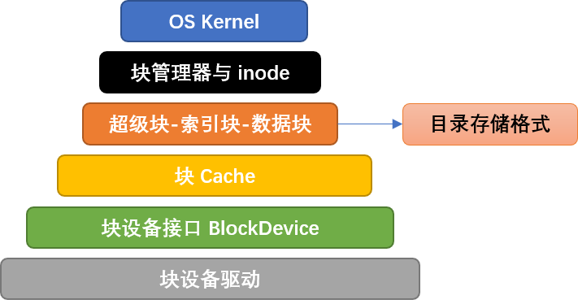

简易文件系统 easy-fs (上)
=======================================

松耦合模块化设计思路
---------------------------------------

内核的功能越来越多，代码量也越来越大。出于解耦合考虑，文件系统 easy-fs 被从内核中分离出来，分成两个不同的 crate ：

- ``easy-fs`` 是简易文件系统的本体；
- ``easy-fs-fuse`` 是能在开发环境（如 Ubuntu）中运行的应用程序，用于将应用打包为 easy-fs 格式的文件系统镜像，也可以用来对 ``easy-fs`` 进行测试。

easy-fs与底层设备驱动之间通过抽象接口 ``BlockDevice`` 来连接，采用轮询方式访问 ``virtio_blk`` 虚拟磁盘设备，避免调用外设中断的相关内核函数。easy-fs 避免了直接访问进程相关的数据和函数，从而能独立于内核开发。

``easy-fs`` crate 以层次化思路设计，自下而上可以分成五个层次：

1. 磁盘块设备接口层：以块为单位对磁盘块设备进行读写的 trait 接口
2. 块缓存层：在内存中缓存磁盘块的数据，避免频繁读写磁盘
3. 磁盘数据结构层：磁盘上的超级块、位图、索引节点、数据块、目录项等核心数据结构和相关处理
4. 磁盘块管理器层：合并了上述核心数据结构和磁盘布局所形成的磁盘文件系统数据结构
5. 索引节点层：管理索引节点，实现了文件创建/文件打开/文件读写等成员函数

本节将介绍前三层，下一节将介绍后两层。

块设备接口层
---------------------------------------

在 ``easy-fs`` 库的最底层声明了块设备的抽象接口 ``BlockDevice`` ：

.. code-block:: rust

    // easy-fs/src/block_dev.rs

    pub trait BlockDevice : Send + Sync + Any {
        fn read_block(&self, block_id: usize, buf: &mut [u8]);
        fn write_block(&self, block_id: usize, buf: &[u8]);
    }

它定义了两个抽象方法：

- ``read_block`` 可以将编号为 ``block_id`` 的块从磁盘读入内存中的缓冲区 ``buf`` ；
- ``write_block`` 可以将内存中的缓冲区 ``buf`` 中的数据写入磁盘编号为 ``block_id`` 的块。

``easy-fs`` 的使用者将负责提供抽象方法的实现。

块缓存层
---------------------------------------

为了加速 IO，内存可以作为磁盘的缓存。实现磁盘块缓存功能的代码在 ``block_cache.rs`` 。

块缓存
+++++++++++++++++++++++++++++++++++++++++

块缓存 ``BlockCache`` 的声明如下：

.. code-block:: rust

    // easy-fs/src/lib.rs

    pub const BLOCK_SZ: usize = 512;

    // easy-fs/src/block_cache.rs

    pub struct BlockCache {
        cache: [u8; BLOCK_SZ],
        block_id: usize,
        block_device: Arc<dyn BlockDevice>,
        modified: bool,
    }

其中：

- ``cache`` 是一个 512 字节的数组，表示位于内存中的缓冲区；
- ``block_id`` 记录了这个块的编号；
- ``block_device`` 记录块所属的底层设备；
- ``modified`` 记录自从这个块缓存从磁盘载入内存之后，它有没有被修改过。

创建 ``BlockCache`` 时，将一个块从磁盘读到缓冲区 ``cache`` ：

.. code-block:: rust

    // easy-fs/src/block_cache.rs

    impl BlockCache {
        /// Load a new BlockCache from disk.
        pub fn new(
            block_id: usize, 
            block_device: Arc<dyn BlockDevice>
        ) -> Self {
            let mut cache = [0u8; BLOCK_SZ];
            block_device.read_block(block_id, &mut cache);
            Self {
                cache,
                block_id,
                block_device,
                modified: false,
            }
        }
    }

``BlockCache`` 向上提供以下方法：

.. code-block:: rust
    :linenos:

    // easy-fs/src/block_cache.rs

    impl BlockCache {
        fn addr_of_offset(&self, offset: usize) -> usize {
            &self.cache[offset] as *const _ as usize
        }

        pub fn get_ref<T>(&self, offset: usize) -> &T where T: Sized {
            let type_size = core::mem::size_of::<T>();
            assert!(offset + type_size <= BLOCK_SZ);
            let addr = self.addr_of_offset(offset);
            unsafe { &*(addr as *const T) } 
        }

        pub fn get_mut<T>(&mut self, offset: usize) -> &mut T where T: Sized {
            let type_size = core::mem::size_of::<T>();
            assert!(offset + type_size <= BLOCK_SZ);
            self.modified = true;
            let addr = self.addr_of_offset(offset);
            unsafe { &mut *(addr as *mut T) }
        }
    }

- ``addr_of_offset`` 可以得到一个 ``BlockCache`` 内部的缓冲区中指定偏移量 ``offset`` 的字节地址；
- ``get_ref`` 是一个泛型方法，它可以获取缓冲区中的位于偏移量 ``offset`` 的一个类型为 ``T`` 的磁盘上数据结构的不可变引用。该泛型方法的 Trait Bound 限制类型 ``T`` 必须是一个编译时已知大小的类型，我们通过 ``core::mem::size_of::<T>()`` 在编译时获取类型 ``T`` 的大小并确认该数据结构被整个包含在磁盘块及其缓冲区之内。这里编译器会自动进行生命周期标注，约束返回的引用的生命周期不超过 ``BlockCache`` 自身，在使用的时候我们会保证这一点。
- ``get_mut`` 与 ``get_ref`` 的不同之处在于它会获取磁盘上数据结构的可变引用，由此可以对数据结构进行修改。由于这些数据结构目前位于内存中的缓冲区中，我们需要将 ``BlockCache`` 的 ``modified`` 标记为 true 表示该缓冲区已经被修改，之后需要将数据写回磁盘块才能真正将修改同步到磁盘。

我们可以将 ``get_ref/get_mut`` 进一步封装为更为易用的形式：

.. code-block:: rust

    // easy-fs/src/block_cache.rs

    impl BlockCache {
        pub fn read<T, V>(&self, offset: usize, f: impl FnOnce(&T) -> V) -> V {
            f(self.get_ref(offset))
        }

        pub fn modify<T, V>(&mut self, offset:usize, f: impl FnOnce(&mut T) -> V) -> V {
            f(self.get_mut(offset))
        }
    }

它们的含义是：在 ``BlockCache`` 缓冲区偏移量为 ``offset`` 的位置，获取一个类型为 ``T`` 不可变/可变引用，将闭包 ``f`` 作用于这个引用，返回 ``f`` 的返回值。  中所定义的操作。

这里我们传入闭包的类型为 ``FnOnce`` ，这是因为闭包里面的变量被捕获的方式涵盖了不可变引用/可变引用/和 move 三种可能性，故而我们需要选取范围最广的 ``FnOnce`` 。参数中的 ``impl`` 关键字体现了一种类似泛型的静态分发功能。

.. warning::

    **Rust 语法卡片：闭包**

    闭包是持有外部环境变量的函数。所谓外部环境, 就是指创建闭包时所在的词法作用域。Rust中定义的闭包，按照对外部环境变量的使用方式（借用、复制、转移所有权），分为三个类型: Fn、FnMut、FnOnce。Fn类型的闭包会在闭包内部以共享借用的方式使用环境变量；FnMut类型的闭包会在闭包内部以独占借用的方式使用环境变量；而FnOnce类型的闭包会在闭包内部以所有者的身份使用环境变量。由此可见，根据闭包内使用环境变量的方式，即可判断创建出来的闭包的类型。

当 ``BlockCache`` 的生命周期结束后，缓冲区也会被回收， ``modified`` 标记将会决定数据是否需要写回磁盘：

.. code-block:: rust

    // easy-fs/src/block_cache.rs

    impl Drop for BlockCache {
        fn drop(&mut self) {
            if self.modified {
                self.modified = false;
                self.block_device.write_block(self.block_id, &self.cache);
            }
        }
    }

块缓存全局管理器
+++++++++++++++++++++++++++++++++++++++++

内存只能同时缓存有限个磁盘块。当我们要对一个磁盘块进行读写时，块缓存全局管理器检查它是否已经被载入内存中，如果是则直接返回，否则就读取磁盘块到内存。如果内存中驻留的磁盘块缓冲区的数量已满，则需要进行缓存替换。这里使用一种类 FIFO 的缓存替换算法，在管理器中只需维护一个队列：

.. code-block:: rust

    // easy-fs/src/block_cache.rs

    use alloc::collections::VecDeque;

    pub struct BlockCacheManager {
        queue: VecDeque<(usize, Arc<Mutex<BlockCache>>)>,
    }

队列 ``queue`` 维护块编号和块缓存的二元组。块缓存的类型是一个 ``Arc<Mutex<BlockCache>>`` ，这是 Rust 中的经典组合，它可以同时提供共享引用和互斥访问。这里的共享引用意义在于块缓存既需要在管理器 ``BlockCacheManager`` 保留一个引用，还需要将引用返回给块缓存的请求者。而互斥访问在单核上的意义在于提供内部可变性通过编译，在多核环境下则可以帮助我们避免可能的并发冲突。

``get_block_cache`` 方法尝试从块缓存管理器中获取一个编号为 ``block_id`` 的块缓存，如果找不到的话会读取磁盘，还有可能会发生缓存替换：

.. code-block:: rust
    :linenos:

    // easy-fs/src/block_cache.rs

    impl BlockCacheManager {
        pub fn get_block_cache(
            &mut self,
            block_id: usize,
            block_device: Arc<dyn BlockDevice>,
        ) -> Arc<Mutex<BlockCache>> {
            if let Some(pair) = self.queue
                .iter()
                .find(|pair| pair.0 == block_id) {
                    Arc::clone(&pair.1)
            } else {
                // substitute
                if self.queue.len() == BLOCK_CACHE_SIZE {
                    // from front to tail
                    if let Some((idx, _)) = self.queue
                        .iter()
                        .enumerate()
                        .find(|(_, pair)| Arc::strong_count(&pair.1) == 1) {
                        self.queue.drain(idx..=idx);
                    } else {
                        panic!("Run out of BlockCache!");
                    }
                }
                // load block into mem and push back
                let block_cache = Arc::new(Mutex::new(
                    BlockCache::new(block_id, Arc::clone(&block_device))
                ));
                self.queue.push_back((block_id, Arc::clone(&block_cache)));
                block_cache
            }
        }
    }

- 第 9 行，遍历整个队列试图找到一个编号相同的块缓存，如果找到，将块缓存管理器中保存的块缓存的引用复制一份并返回；
- 第 13 行对应找不到的情况，此时必须将块从磁盘读入内存中的缓冲区。读取前需要判断已保存的块数量是否达到了上限。是，则执行缓存替换算法，替换的标准是其强引用计数 :math:`\eq 1` ，即除了块缓存管理器保留的一份副本之外，在外面没有副本正在使用。
- 第 27 行开始，创建一个新的块缓存（会触发 ``read_block`` 进行块读取）并加入到队尾，最后返回给请求者。

磁盘布局及磁盘上数据结构
---------------------------------------

磁盘数据结构层的代码在 ``layout.rs`` 和 ``bitmap.rs`` 中。

easy-fs 磁盘布局概述
+++++++++++++++++++++++++++++++++++++++

easy-fs 磁盘按照块编号从小到大顺序分成 5 个连续区域：

- 第一个区域只包括一个块，它是 **超级块** (Super Block)，用于定位其他连续区域的位置，检查文件系统合法性。
- 第二个区域是一个索引节点位图，长度为若干个块。它记录了索引节点区域中有哪些索引节点已经被分配出去使用了。
- 第三个区域是索引节点区域，长度为若干个块。其中的每个块都存储了若干个索引节点。
- 第四个区域是一个数据块位图，长度为若干个块。它记录了后面的数据块区域中有哪些已经被分配出去使用了。
- 最后的区域则是数据块区域，其中的每个被分配出去的块保存了文件或目录的具体内容。

easy-fs 超级块
+++++++++++++++++++++++++++++++++++++++

超级块 ``SuperBlock`` 的内容如下：

.. code-block:: rust

    // easy-fs/src/layout.rs

    #[repr(C)]
    pub struct SuperBlock {
        magic: u32,
        pub total_blocks: u32,
        pub inode_bitmap_blocks: u32,
        pub inode_area_blocks: u32,
        pub data_bitmap_blocks: u32,
        pub data_area_blocks: u32,
    }

其中， ``magic`` 是一个用于文件系统合法性验证的魔数， ``total_block`` 给出文件系统的总块数。后面的四个字段则分别给出 easy-fs 布局中后四个连续区域的长度各为多少个块。

下面是它实现的方法：

.. code-block:: rust

    // easy-fs/src/layout.rs

    impl SuperBlock {
        pub fn initialize(
            &mut self,
            total_blocks: u32,
            inode_bitmap_blocks: u32,
            inode_area_blocks: u32,
            data_bitmap_blocks: u32,
            data_area_blocks: u32,
        );

        pub fn is_valid(&self) -> bool {
            self.magic == EFS_MAGIC
        }
    }

- ``initialize`` 用于在创建一个 easy-fs 的时候初始化超级块，各个区域的块数由更上层的磁盘块管理器传入。
- ``is_valid`` 则可以通过魔数判断超级块所在的文件系统是否合法。

位图
+++++++++++++++++++++++++++++++++++++++

在 easy-fs 布局中存在两类不同的位图，分别对索引节点和数据块进行管理。每个位图都由若干个块组成，每个块大小 4096 bits。每个 bit 都代表一个索引节点/数据块的分配状态。

.. code-block:: rust

    // easy-fs/src/bitmap.rs

    pub struct Bitmap {
        start_block_id: usize,
        blocks: usize,
    }

    type BitmapBlock = [u64; 64];

``Bitmap`` 是位图区域的管理器，它保存了位图区域的起始块编号和块数。而 ``BitmapBlock`` 将位图区域中的一个磁盘块解释为长度为 64 的一个 ``u64`` 数组。

首先来看 ``Bitmap`` 如何分配一个bit：

.. code-block:: rust
    :linenos:

    // easy-fs/src/bitmap.rs
    
    const BLOCK_BITS: usize = BLOCK_SZ * 8;
    
    impl Bitmap {
        pub fn alloc(&self, block_device: &Arc<dyn BlockDevice>) -> Option<usize> {
            for block_id in 0..self.blocks {
                let pos = get_block_cache(
                    block_id + self.start_block_id as usize,
                    Arc::clone(block_device),
                )
                .lock()
                .modify(0, |bitmap_block: &mut BitmapBlock| {
                    if let Some((bits64_pos, inner_pos)) = bitmap_block
                        .iter()
                        .enumerate()
                        .find(|(_, bits64)| **bits64 != u64::MAX)
                        .map(|(bits64_pos, bits64)| {
                            (bits64_pos, bits64.trailing_ones() as usize)
                        }) {
                        // modify cache
                        bitmap_block[bits64_pos] |= 1u64 << inner_pos;
                        Some(block_id * BLOCK_BITS + bits64_pos * 64 + inner_pos as usize)
                    } else {
                        None
                    }
                });
                if pos.is_some() {
                    return pos;
                }
            }
            None
        }
    }

其主要思路是遍历区域中的每个块，再在每个块中以bit组（每组 64 bits）为单位进行遍历，找到一个尚未被全部分配出去的组，最后在里面分配一个bit。它将会返回分配的bit所在的位置，等同于索引节点/数据块的编号。如果所有bit均已经被分配出去了，则返回 ``None`` 。

第 7 行枚举区域中的每个块（编号为 ``block_id`` ），在循环内部我们需要读写这个块，在块内尝试找到一个空闲的bit并置 1 。一旦涉及到块的读写，就需要用到块缓存层提供的接口：

- 第 8 行我们调用 ``get_block_cache`` 获取块缓存，注意我们传入的块编号是区域起始块编号 ``start_block_id`` 加上区域内的块编号 ``block_id`` 得到的块设备上的块编号。
- 第 12 行我们通过 ``.lock()`` 获取块缓存的互斥锁从而可以对块缓存进行访问。
- 第 13 行我们使用到了 ``BlockCache::modify`` 接口。它传入的偏移量 ``offset`` 为 0，这是因为整个块上只有一个 ``BitmapBlock`` ，它的大小恰好为 512 字节。因此我们需要从块的开头开始才能访问到完整的 ``BitmapBlock`` 。同时，传给它的闭包需要显式声明参数类型为 ``&mut BitmapBlock`` ，不然的话， ``BlockCache`` 的泛型方法 ``modify/get_mut`` 无法得知应该用哪个类型来解析块上的数据。在声明之后，编译器才能在这里将两个方法中的泛型 ``T`` 实例化为具体类型 ``BitmapBlock`` 。
  
  总结一下，这里 ``modify`` 的含义就是：从缓冲区偏移量为 0 的位置开始将一段连续的数据（数据的长度随具体类型而定）解析为一个 ``BitmapBlock`` 并要对该数据结构进行修改。在闭包内部，我们可以使用这个 ``BitmapBlock`` 的可变引用 ``bitmap_block`` 对它进行访问。 ``read/get_ref`` 的用法完全相同，后面将不再赘述。
- 闭包的主体位于第 14~26 行。它尝试在 ``bitmap_block`` 中找到一个空闲的bit并返回其位置，如果不存在的话则返回 ``None`` 。它的思路是，遍历每 64 bits构成的组（一个 ``u64`` ），如果它并没有达到 ``u64::MAX`` （即 :math:`2^{64}-1` ），则通过 ``u64::trailing_ones`` 找到最低的一个 0 并置为 1 。如果能够找到的话，bit组的编号将保存在变量 ``bits64_pos`` 中，而分配的bit在组内的位置将保存在变量 ``inner_pos`` 中。在返回分配的bit编号的时候，它的计算方式是 ``block_id*BLOCK_BITS+bits64_pos*64+inner_pos`` 。注意闭包中的 ``block_id`` 并不在闭包的参数列表中，因此它是从外部环境（即自增 ``block_id`` 的循环）中捕获到的。

我们一旦在某个块中找到一个空闲的bit并成功分配，就不再考虑后续的块。第 28 行体现了提前返回的思路。

回收 bit 的方法类似，感兴趣的读者可自行阅读源代码。

磁盘上索引节点
+++++++++++++++++++++++++++++++++++++++

在磁盘上的索引节点区域，每个块上都保存着若干个索引节点 ``DiskInode`` ：

.. code-block:: rust

    // easy-fs/src/layout.rs

    const INODE_DIRECT_COUNT: usize = 28;

    #[repr(C)]
    pub struct DiskInode {
        pub size: u32,
        pub direct: [u32; INODE_DIRECT_COUNT],
        pub indirect1: u32,
        pub indirect2: u32,
        type_: DiskInodeType,
    }

    #[derive(PartialEq)]
    pub enum DiskInodeType {
        File,
        Directory,
    }

每个文件/目录在磁盘上均以一个 ``DiskInode`` 的形式存储。其中包含文件/目录的元数据： ``size`` 表示文件/目录内容的字节数， ``type_`` 表示索引节点的类型 ``DiskInodeType`` ，目前仅支持文件 ``File`` 和目录 ``Directory`` 两种类型。其余的 ``direct/indirect1/indirect2`` 都是存储文件内容/目录内容的数据块的索引，这也是索引节点名字的由来。

为了尽可能节约空间，在进行索引的时候，块的编号用一个 ``u32`` 存储。索引方式分成直接索引和间接索引两种：

- 当文件很小的时候，只需用到直接索引， ``direct`` 数组中最多可以指向 ``INODE_DIRECT_COUNT`` 个数据块，当取值为 28 的时候，通过直接索引可以找到 14KiB 的内容。
- 当文件比较大的时候，不仅直接索引的 ``direct`` 数组装满，还需要用到一级间接索引 ``indirect1`` 。它指向一个一级索引块，这个块也位于磁盘布局的数据块区域中。这个一级索引块中的每个 ``u32`` 都用来指向数据块区域中一个保存该文件内容的数据块，因此，最多能够索引 :math:`\frac{512}{4}=128` 个数据块，对应 64KiB 的内容。
- 当文件大小超过直接索引和一级索引支持的容量上限 78KiB 的时候，就需要用到二级间接索引 ``indirect2`` 。它指向一个位于数据块区域中的二级索引块。二级索引块中的每个 ``u32`` 指向一个不同的一级索引块，这些一级索引块也位于数据块区域中。因此，通过二级间接索引最多能够索引 :math:`128\times 64\text{KiB}=8\text{MiB}` 的内容。

为了充分利用空间，我们将 ``DiskInode`` 的大小设置为 128 字节，每个块正好能够容纳 4 个 ``DiskInode`` 。在后续需要支持更多类型的元数据的时候，可以适当缩减直接索引 ``direct`` 的块数，并将节约出来的空间用来存放其他元数据，仍可保证 ``DiskInode`` 的总大小为 128 字节。

通过 ``initialize`` 方法可以初始化一个 ``DiskInode`` 为一个文件或目录：

.. code-block:: rust

    // easy-fs/src/layout.rs

    impl DiskInode {
        /// indirect1 and indirect2 block are allocated only when they are needed.
        pub fn initialize(&mut self, type_: DiskInodeType) {
            self.size = 0;
            self.direct.iter_mut().for_each(|v| *v = 0);
            self.indirect1 = 0;
            self.indirect2 = 0;
            self.type_ = type_;
        }
    }

需要注意的是， ``indirect1/2`` 均被初始化为 0 。因为最开始文件内容的大小为 0 字节，并不会用到一级/二级索引。为了节约空间，我们会完全按需分配一级/二级索引块。此外，直接索引 ``direct`` 也被清零。

``is_file`` 和 ``is_dir`` 两个方法可以用来确认 ``DiskInode`` 的类型为文件还是目录：

.. code-block:: rust

    // easy-fs/src/layout.rs

    impl DiskInode {
        pub fn is_dir(&self) -> bool {
            self.type_ == DiskInodeType::Directory
        }
        pub fn is_file(&self) -> bool {
            self.type_ == DiskInodeType::File
        }
    }

``get_block_id`` 方法体现了 ``DiskInode`` 最重要的数据块索引功能，它可以从索引中查到它自身用于保存文件内容的第 ``block_id`` 个数据块的块编号，这样后续才能对这个数据块进行访问：

.. code-block:: rust
    :linenos:
    :emphasize-lines: 10,12,18

    // easy-fs/src/layout.rs

    const INODE_INDIRECT1_COUNT: usize = BLOCK_SZ / 4;
    const INDIRECT1_BOUND: usize = DIRECT_BOUND + INODE_INDIRECT1_COUNT;
    type IndirectBlock = [u32; BLOCK_SZ / 4];

    impl DiskInode {
        pub fn get_block_id(&self, inner_id: u32, block_device: &Arc<dyn BlockDevice>) -> u32 {
            let inner_id = inner_id as usize;
            if inner_id < INODE_DIRECT_COUNT {
                self.direct[inner_id]
            } else if inner_id < INDIRECT1_BOUND {
                get_block_cache(self.indirect1 as usize, Arc::clone(block_device))
                    .lock()
                    .read(0, |indirect_block: &IndirectBlock| {
                        indirect_block[inner_id - INODE_DIRECT_COUNT]
                    })
            } else {
                let last = inner_id - INDIRECT1_BOUND;
                let indirect1 = get_block_cache(
                    self.indirect2 as usize,
                    Arc::clone(block_device)
                )
                .lock()
                .read(0, |indirect2: &IndirectBlock| {
                    indirect2[last / INODE_INDIRECT1_COUNT]
                });
                get_block_cache(
                    indirect1 as usize,
                    Arc::clone(block_device)
                )
                .lock()
                .read(0, |indirect1: &IndirectBlock| {
                    indirect1[last % INODE_INDIRECT1_COUNT]
                })
            }
        }
    }

这里需要说明的是：

- 第 10/12/18 行分别利用直接索引/一级索引和二级索引，具体选用哪种索引方式取决于 ``block_id`` 所在的区间。
- 在对一个索引块进行操作的时候，我们将其解析为磁盘数据结构 ``IndirectBlock`` ，实质上就是一个 ``u32`` 数组，每个都指向一个下一级索引块或者数据块。
- 对于二级索引的情况，需要先查二级索引块找到挂在它下面的一级索引块，再通过一级索引块找到数据块。

在初始化之后文件/目录的 ``size`` 均为 0 ，此时并不会索引到任何数据块。它需要通过 ``increase_size`` 方法逐步扩充容量。在扩充的时候，自然需要一些新的数据块来作为索引块或是保存内容的数据块。我们需要先编写一些辅助方法来确定在容量扩充的时候额外需要多少块：

.. code-block:: rust

    // easy-fs/src/layout.rs

    impl DiskInode {
        /// Return block number correspond to size.
        pub fn data_blocks(&self) -> u32 {
            Self::_data_blocks(self.size)
        }
        fn _data_blocks(size: u32) -> u32 {
            (size + BLOCK_SZ as u32 - 1) / BLOCK_SZ as u32
        }
        /// Return number of blocks needed include indirect1/2.
        pub fn total_blocks(size: u32) -> u32 {
            let data_blocks = Self::_data_blocks(size) as usize;
            let mut total = data_blocks as usize;
            // indirect1
            if data_blocks > INODE_DIRECT_COUNT {
                total += 1;
            }
            // indirect2
            if data_blocks > INDIRECT1_BOUND {
                total += 1;
                // sub indirect1
                total += (data_blocks - INDIRECT1_BOUND + INODE_INDIRECT1_COUNT - 1) / INODE_INDIRECT1_COUNT;
            }
            total as u32
        }
        pub fn blocks_num_needed(&self, new_size: u32) -> u32 {
            assert!(new_size >= self.size);
            Self::total_blocks(new_size) - Self::total_blocks(self.size)
        }
    }

``data_blocks`` 方法可以计算为了容纳自身 ``size`` 字节的内容需要多少个数据块。计算的过程只需用 ``size`` 除以每个块的大小 ``BLOCK_SZ`` 并向上取整。而 ``total_blocks`` 不仅包含数据块，还需要统计索引块。计算的方法也很简单，先调用 ``data_blocks`` 得到需要多少数据块，再根据数据块数目所处的区间统计索引块即可。 ``blocks_num_needed`` 可以计算将一个 ``DiskInode`` 的 ``size`` 扩容到 ``new_size`` 需要额外多少个数据和索引块。这只需要调用两次 ``total_blocks`` 作差即可。

下面给出 ``increase_size`` 方法的接口：

.. code-block:: rust

    // easy-fs/src/layout.rs

    impl DiskInode {
        pub fn increase_size(
            &mut self,
            new_size: u32,
            new_blocks: Vec<u32>,
            block_device: &Arc<dyn BlockDevice>,
        );
    }

其中 ``new_size`` 表示容量扩充之后的文件大小； ``new_blocks`` 是一个保存了本次容量扩充所需块编号的向量，这些块都是由上层的磁盘块管理器负责分配的。 ``increase_size`` 的实现有些复杂，在这里不详细介绍。大致的思路是按照直接索引、一级索引再到二级索引的顺序进行扩充。

有些时候我们还需要清空文件的内容并回收所有数据和索引块。这是通过 ``clear_size`` 方法来实现的：

.. code-block:: rust

    // easy-fs/src/layout.rs

    impl DiskInode {
        /// Clear size to zero and return blocks that should be deallocated.
        ///
        /// We will clear the block contents to zero later.
        pub fn clear_size(&mut self, block_device: &Arc<dyn BlockDevice>) -> Vec<u32>;
    }

它会将回收的所有块的编号保存在一个向量中返回给磁盘块管理器。它的实现原理和 ``increase_size`` 一样也分为多个阶段，在这里不展开。

接下来需要考虑通过 ``DiskInode`` 来读写它索引的那些数据块中的数据。这些数据可以被视为一个字节序列，而每次我们都是选取其中的一段连续区间进行操作，以 ``read_at`` 为例：

.. code-block:: rust
    :linenos:

    // easy-fs/src/layout.rs

    type DataBlock = [u8; BLOCK_SZ];

    impl DiskInode {
        pub fn read_at(
            &self,
            offset: usize,
            buf: &mut [u8],
            block_device: &Arc<dyn BlockDevice>,
        ) -> usize {
            let mut start = offset;
            let end = (offset + buf.len()).min(self.size as usize);
            if start >= end {
                return 0;
            }
            let mut start_block = start / BLOCK_SZ;
            let mut read_size = 0usize;
            loop {
                // calculate end of current block
                let mut end_current_block = (start / BLOCK_SZ + 1) * BLOCK_SZ;
                end_current_block = end_current_block.min(end);
                // read and update read size
                let block_read_size = end_current_block - start;
                let dst = &mut buf[read_size..read_size + block_read_size];
                get_block_cache(
                    self.get_block_id(start_block as u32, block_device) as usize,
                    Arc::clone(block_device),
                )
                .lock()
                .read(0, |data_block: &DataBlock| {
                    let src = &data_block[start % BLOCK_SZ..start % BLOCK_SZ + block_read_size];
                    dst.copy_from_slice(src);
                });
                read_size += block_read_size;
                // move to next block
                if end_current_block == end { break; }
                start_block += 1;
                start = end_current_block;
            }
            read_size
        }
    }

它的含义是：将文件内容从 ``offset`` 字节开始的部分读到内存中的缓冲区 ``buf`` 中，并返回实际读到的字节数。如果文件剩下的内容还足够多，那么缓冲区会被填满；不然的话文件剩下的全部内容都会被读到缓冲区中。具体实现上有很多细节，但大致的思路是遍历位于字节区间 ``start,end`` 中间的那些块，将它们视为一个 ``DataBlock`` （也就是一个字节数组），并将其中的部分内容复制到缓冲区 ``buf`` 中适当的区域。 ``start_block`` 维护着目前是文件内部第多少个数据块，需要首先调用 ``get_block_id`` 从索引中查到这个数据块在块设备中的块编号，随后才能传入 ``get_block_cache`` 中将正确的数据块缓存到内存中进行访问。

在第 14 行进行了简单的边界条件判断，如果要读取的内容超出了文件的范围那么直接返回 0 表示读取不到任何内容。

``write_at`` 的实现思路基本上和 ``read_at`` 完全相同。但不同的是 ``write_at`` 不会出现失败的情况，传入的整个缓冲区的数据都必定会被写入到文件中。当从 ``offset`` 开始的区间超出了文件范围的时候，就需要调用者在调用 ``write_at`` 之前提前调用 ``increase_size`` 将文件大小扩充到区间的右端保证写入的完整性。

目录项
+++++++++++++++++++++++++++++++++++++++

对于文件而言，它的内容在文件系统或内核看来没有任何既定的格式，只是一个字节序列。目录的内容却需要遵从一种特殊的格式，它可以看成一个目录项的序列，每个目录项都是一个二元组，包括目录下文件的文件名和索引节点编号。目录项 ``DirEntry`` 的定义如下：

.. code-block:: rust

    // easy-fs/src/layout.rs

    const NAME_LENGTH_LIMIT: usize = 27;

    #[repr(C)]
    pub struct DirEntry {
        name: [u8; NAME_LENGTH_LIMIT + 1],
        inode_number: u32,
    }

    pub const DIRENT_SZ: usize = 32;

目录项 ``Dirent`` 保存的文件名长度不能超过 27。目录项自身长 32 字节，每个数据块可以存储 16 个目录项。可以通过 ``empty`` 和 ``new`` 方法生成目录项，通过 ``name`` 和 ``inode_number`` 方法取出目录项中的内容：

.. code-block:: rust

    // easy-fs/src/layout.rs

    impl DirEntry {
        pub fn empty() -> Self;
        pub fn new(name: &str, inode_number: u32) -> Self;
        pub fn name(&self) -> &str;
        pub fn inode_number(&self) -> u32
    }

在从目录中读取目录项，或将目录项写入目录时，需要将目录项转化为缓冲区（即字节切片）的形式来符合 ``read_at OR write_at`` 接口的要求：

.. code-block:: rust

    // easy-fs/src/layout.rs

    impl DirEntry {
        pub fn as_bytes(&self) -> &[u8] {
            unsafe {
                core::slice::from_raw_parts(
                    self as *const _ as usize as *const u8,
                    DIRENT_SZ,
                )
            }
        }
        pub fn as_bytes_mut(&mut self) -> &mut [u8] {
            unsafe {
                core::slice::from_raw_parts_mut(
                    self as *mut _ as usize as *mut u8,
                    DIRENT_SZ,
                )
            }
        }
    }
